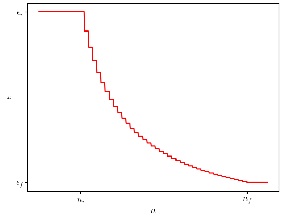
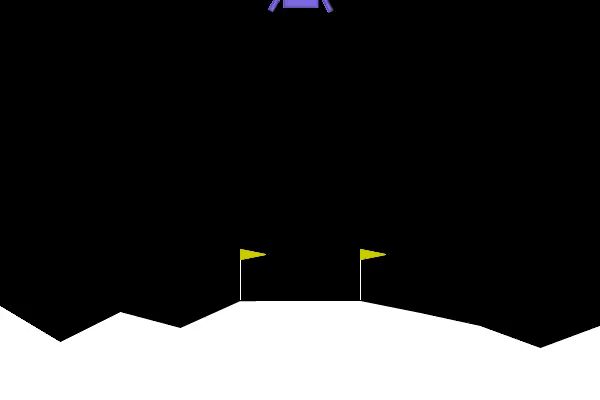
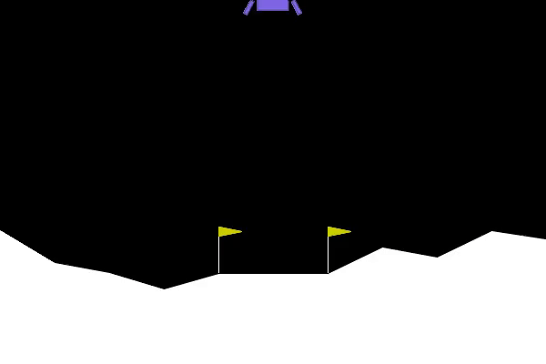

# Reinforcement learning
Implementation of a deep $Q$-learning (**DQN**) model for solving the lunar landing problem provided by [Gymnasium](https://gymnasium.farama.org/), using _PyTorch_.

In order to install the required libraries, one can follow the instructions provided in the video [Install Gymnasium on Windows](https://www.youtube.com/watch?v=gMgj4pSHLww&ab_channel=JohnnyCode).

## Environment
The environment *LunarLander-v3* is made of states of the form $(x, y, v_x, v_y, \theta, \omega, \mathrm{land}_1, \mathrm{land}_2)$, where:

- $x$ and $y$ represent the position components;
- $v_x$ and $v_y$ represent the velocity components;
- $\theta$ and $\omega$ represent the rotation angle and angular velocity, respectively;
- $\mathrm{land}_i$ indicates whether leg $i$ touches the ground.

The action space is made of

- action 0: do nothing;
- action 1: fire left engine;
- action 2: fire main engine;
- action 3: fire right engine.

## Model
The exploration parameter $\epsilon$ is modelled in the following way, as a function of the episode number:

$$\epsilon(n) =
\begin{cases}
\epsilon_i &\mathrm{if}\quad n \leq n_i \\
\epsilon_i + (\epsilon_f - \epsilon_i) \dfrac{n_f}{n_i - n_f}\left(1 - \dfrac{n_i}{\tilde n}\right) &\mathrm{if}\quad n_i < n \leq n_f \\
\epsilon_f  &\mathrm{if}\quad n > n_f
\end{cases},$$

where $\tilde n \equiv n \mod m$, where $m$ is an integer which determines for how many episodes $\epsilon$ is kept constant before next decay.

The shape of $\epsilon$ is shown in the following plot:

## Result
Initial result of the agent:

After 300 episodes:

At the end of the training:

